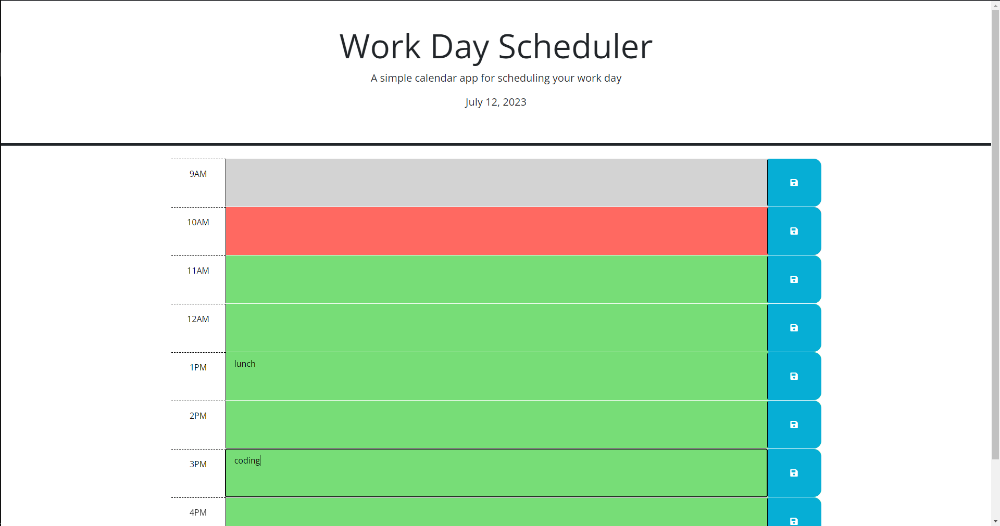

## Coding Bootcamp Challenge 3

## Description

Challenge 5 of coding bootcamp. Using jquery to create an interactive Day Scheduler and Day.js library to display the date.

## Webpage Address

https://brenden-uni.github.io/challenge-5/

## Screenshot

## Installation

N/A

## Credits

N/A

## License

Refer to repo

